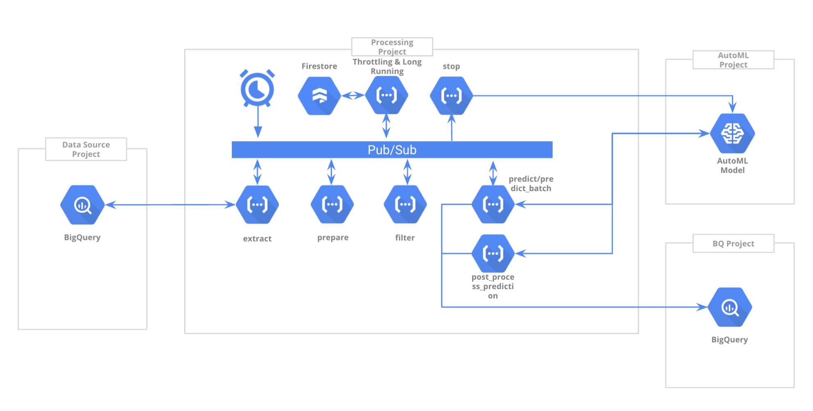

# Prediction framework

## Summary

This solutions simplifies deployment of prediction solutions. It is designed to
provide a basic scaffolding suitable for most predictive solutions, allowing for
customization depending on the specific project.

Despite being initially designed for LTV prediction, it could be used for any
kind of prediction by just removing some of the parts.

## Prerequisites

The framework will fit almost all use cases under the following conditions:

*   Data source is stored in BQ
*   Data output is stored in BQ
*   Prepare, filter and post-process: &lt; 540 seconds time-limit (Cloud
    Function limit)
*   Vertex AutoML model is used (if BQML or Tensorflow small changes need to be 
    done)
*   You are familiar with Python
*   The service account from the default Google project is used. That service
    account must be granted access to external resources. (If different SAs for
    different projects are needed, small changes will be required on the 
    deployment process)

## What is this framework?

This framework is an effort to generalise all the steps involved in a prediction
project: extract, prepare (aka feature eng.), filter, predict and post-process
plus some operational functionality like backfilling, throttling (for API limits),
synchronisation, storage and reporting so it could be reused, saving 80% of the
development time.

The idea behind the framework is that with just a few
particularizations/modifications (some of them important) the framework would
fit any similar use case, with a high level or reliability.

## What does this framework do?



Note: different projects are defined in the picture to represent a typical use
case, but everything could be under the very same project for other use cases.
The framework is flexible enough to address that scenario.

### Understanding the different steps

*   **Extract**: this step will on a timely basis, query the transactions from
    the data source, corresponding to the run date (scheduler or backfill run
    date) and will store them in a new table into the local project BigQuery.
*   **Prepare**: immediately after the transactions extract for one
    specific date is available, the data will be picked up from the local
    BigQuery and processed according to the specs of the model. Once the data is
    processed, it will be stored in a new table into the local project BigQuery.
*   **Filter**: this step will query the data stored by the prepare process and
    will filter the required data and store it into the local project BigQuery.
    (i.e only taking into consideration new customers transactionsWhat a new
    customer is up to the instantiation of the framework for the specific use
    case. Will be covered later).
*   **Predict**: once the new customers are stored, this step will read them
    from BigQuery and call the prediction using Vertex API. A formula based
    on the result of the prediction could be applied to tune the value or to
    apply thresholds. Once the data is ready, it will be stored into the
    BigQuery within the target project.
*   **Post\_process**: A formula could be applied
    to the AutoML batch results to tune the value or to apply thresholds. Once
    the data is ready, it will be stored into the BigQuery within the target
    project.

### Understanding the BQ tables

All tables are sharded tables by date:

#### `all_periodic_transactions_YYYYMMDD`

Stores all the transactions corresponding to the execution date. Since data is
lagged the date of the data with the table will not correspond with the date of
the table name. The schema will depend on the particular use case query.

#### `prepared_periodic_transactions_YYYYMMDD`

Stores transactions for one single day, the transactions from
`all_periodic_transactions_YYYYMMDD` are aggregated and should include those
metrics required by your model to perform the prediction. The schema will depend
on the particular use case. The idea is to get the same table structure and data
that you will pass when calling AutoML.

#### `prepared_new_customers_periodic_transactions_YYYYMMDD`

This table is intended to store those transactions from new customers only. If
your use case requires to predict only on new customers, include them into this
table filtering old onee using the corresponding SQL. Otherwise just `select \*
from prepared_periodic_transactions_YYYYMMDD`. The schema will depend on the
particular use case query.

#### `predictions_YYYYMMDD`

This table contains the LTV predictions for the transactions in
`prepared_new_customers_periodic_transactions_YYYYMMDD`. Since the ultimate
purpose of this table is to feed Google Ads, Campaign Manager 360, SA360 or any
other system interested into the conversion value, the schema will look similar
to the following one (it could be customised using the hook functions):

Field name       | Type   | Mode
---------------- | ------ | --------
clientId         | STRING | REQUIRED
orderId          | STRING | REQUIRED
gclid            | STRING | REQUIRED
date             | STRING | REQUIRED
conversionValue  | FLOAT  | REQUIRED
conversionValue2 | FLOAT  | REQUIRED
conversionValue3 | FLOAT  | REQUIRED
conversionValue4 | FLOAT  | REQUIRED
conversionValue5 | FLOAT  | REQUIRED

#### `metadata`

Stores the information regarding the model to use, which will be used to
correlate with the features table date suffix. This table is generated 
automatically by the deployment script. The schema is fixed:

Field name  | Type   | Mode
----------- | ------ | --------
export_date | STRING | NULLABLE
model_date  | STRING | NULLABLE
model_id  | STRING | NULLABLE

Where:

*   `export_date` indicates the latest full data export for training happened.
    It will be used for automatic model training in the future.
*   `model_date` : indicates the data used to train the model. This correlates
    with the features table.
*   `model_id`: the ID of the AutoML model

Example:

Row | export_date | model_date | model_id                  |     |
--- | ----------- | ---------- | --------------------------- | ---
1   | 20200605    | null       | null                        |
6   | null        | 20200605   | 7662206262901211136         |

#### `training_data_features_YYYYMMDD`

This table stores all the features used by the model. They are needed for the
prediction phase. The suffix YYYYMMDD must match the model data set in the
metadata. The suggested schema is as follows, but it could be customised:

Field name | Type   | Mode
---------- | ------ | --------
value      | STRING | REQUIRED
type       | STRING | REQUIRED

Example:

Row | value    | type
--- | -------- | --------
1   | cat20093 | category
2   | nestle   | brand

#### Additional custom tables

Additional tables can be added if required by the custom algorithms. This can be
achieved via customization scripts. In order to run these scripts when the
solution is deployed, you may add them to `deploy/customization/scripts`. Then,
add a call to them on `deploy/customization/scripts/custom_deploy.sh`

#### Why this table choice?

Because it is very easy to report on:

*   The increase on the number of conversions and new customer conversions
*   The increase of AOV in overall and new customer conversions
*   The evolution of advanced indicators to understand if LTV bidding is working
*   The relationship between different types of conversions
*   Any kind of historical query is easier and cheaper than performing them over
    massive data sources (i.e TB of data from Google Analytics)

If extra tables are needed it is possible to create and use them from the
customization code.

### Understanding the Firestore collections

Firestore is used for throttling, wait & notify and synchronize patterns.

There are 4 different collections used:

#### `<DEPLOYMENT_NAME>.<SOLUTION_PREFIX>_prepare_periodic_tx_tracking`

Logs the activities which are still in prepare data. It is used to not trigger
the extraction of new customer transactions until all “prepare” activities are
completed. To decide if a customer is new or not, usually a time window is
considered, therefore the past data must be stored before looking to query such
time window.

#### `<DEPLOYMENT_NAME>.<SOLUTION_PREFIX>_prediction_tracking`

This collection is used to track if any prediction task is still running, so the
stop model process does not stop the AutoML model while prediction is happening.

#### `<DEPLOYMENT_NAME>.<SOLUTION_PREFIX>_long_running_tasks`

This collection is used to store the messages which have been throttled or
pending on a long running operation like AutoML model deploy.

#### `<DEPLOYMENT_NAME>.<SOLUTION_PREFIX>_unitary_prediction_tracking<prediction_table>`

This is just for traceability purposes, in case something would fail. Only for
AutoML Live scenario.

#### Collection names examples:

`demo_pltv_example_prepare_periodic_tx_tracking`

`demo_pltv_example_long_running_tasks`

`demo_pltv_example_prediction_tracking`

`demo_pltv_example_unitary_prediction_tracking_test-ltv-deploy.ltv_ml.predictions_20200511`

## What can I do with the predictions?

As mentioned before, the ultimate purpose of this setup is to feed GAds,
Campaign Manager, SA360 or any other system interested in conversion values,
with the system predicted conversion values.

All predicted data will be available in the BQ `predictions_YYYYMMDD` tables, so
depending on the case there will be various ways to feed the data to the target
system (APIs, file transfers….), but when using Google products one of the
easiest and most flexible ways of uploading conversions will be by using the
open source tool:
[Tentacles](https://github.com/GoogleCloudPlatform/cloud-for-marketing/tree/master/marketing-analytics/activation/gmp-googleads-connector).

## How to instantiate the framework for your use case

### Directory structure

There’re 2 main directories: `cfs` containing the cloud functions code (not to
be altered unless extending the framework) and `deploy` directory, containing
all the scripts required to make the deployment plus any customizations needed
for the particular use case.


### Training phase

_Note: Automatic training and metadata update is in the roadmap_

### Prediction phase

At this point you must have:

*   An AutoML model.
*   The set of features used by the model (AutoML dataset?).
*   Any extra calculated data required by the model during training (price
    averages etc…)

#### Environment Variables Setting

Set the deployment name and solution prefix. This will be used to name all the
GCP resources to be created:

```
    # General settings
    DEPLOYMENT_NAME: 'demo'
    SOLUTION_PREFIX: 'pltv_example’
```

Set the service account to be used in all CFs. If it does not exist yet, do not
include the domain, but just the name you want for the service account. If
different accounts needed for different projects, changes must be made in the
code.

```
    SERVICE_ACCOUNT: '1234567-compute@developer.gserviceaccount.com'
```

Set the GCP project and region where all the main processing will take place
(cloud functions, task poller, writer and firestore).

```
DEFAULT_GCP_PROJECT: ‘my-google-project’
DEFAULT_GCP_REGION: 'europe-west1'
```

Set data source GCP project, dataset and tables: `BQ_DATA_SOURCE_GCP_PROJECT:
the project where the data source is. BQ_DATA_SOURCE_DATA_SET: the dataset where
the data source is. BQ_DATA_SOURCE_TABLES: the tables template to use as a data
source.`

Sample values:

```
# BQ Data source settings
BQ_DATA_SOURCE_GCP_PROJECT: ‘myclient-123456'
BQ_DATA_SOURCE_DATA_SET: '1234567'
BQ_DATA_SOURCE_TABLES: 'ga_sessions'
```

Set the GCP dataset and region (used for data transfer) where all the
intermediate processing is going to happen (it could be different from data
source project):

```
BQ_LTV_GCP_PROJECT: the project used to store the data and the scheduled query.
BQ_LTV_GCP_BROAD_REGION: region used to create the datasets.
BQ_LTV_DATASET: dataset name to be used for all the generated tables.
```

Sample Values:

```BQ_LTV_GCP_PROJECT:
BQ_LTV_GCP_BROAD_REGION: 'EU' BQ_LTV_DATASET: 'pltv'

```

Set model configuration:

```MODEL_GCP_PROJECT:
resides. MODEL_REGION: the region of the project where the model resides.
MODEL_AUTOML_API_ENDPOINT: the endpoint according to the region.
MODEL_NEW_CLIENT_DAYS: number of days which will define the cohort for new
customers.
MODEL_DATE: Date where the model was trained in YYYYMMDD format. It will be used
to label metadata.
```

Sample values:

```MODEL_GCP_PROJECT:
MODEL_AUTOML_API_ENDPOINT: 'eu-automl.googleapis.com:443'
MODEL_NEW_CLIENT_DAYS: '365'
MODEL_DATE: '20210601'
```

Set scheduler settings:

```
TIMEZONE: the timezone used to create the schedulers.
DATA_SOURCE_PERIODIC_TX_POLLER_CONFIG: cron syntax for model data source extractor scheduler.
LONG_RUNNING_TASKS_POLLER_CONFIG: cron syntax for polling waiting tasks.
DISCARD_TASKS_OLDER_THAN_HOURS: expiration time in hours for the waiting tasks
```

Sample values: 
```
DATA_SOURCE_PERIODIC_TX_POLLER_CONFIG: '0 \*/1 \* \* \*'
LONG_RUNNING_TASKS_POLLER_CONFIG: '\*/2 \* \* \* \*'
DISCARD_TASKS_OLDER_THAN_HOURS: '23' TIMEZONE: 'Europe/Madrid'
```

Set the amount of minutes the stopper has to consider as inactivity, after the
latest prediction task activity:

```
STOP_MODEL_WAITING_MINUTES: ‘30’
```

##### Tuning parameters

In order to avoid quota problems (max. concurrent requests, max. connections
open …) throttling needed to be in place.

###### Polling & throttling settings

`DATA_SOURCE_PERIODIC_TX_POLLER_CONFIG**: '0 \*/1 \* \* \*'` → the poller
that triggers the periodic export. Default every hour.

`LONG_RUNNING_TASKS_POLLER_CONFIG: '\*/2 \* \* \* \*'` → the poller to check the
enqueued tasks (either intentionally delayed or long running ones). Default 2
minutes.

`DISCARD_TASKS_OLDER_THAN_HOURS: '24'` → how long a task will be waiting in the
“queue” (if running daily reports, more than 24 hours does not make sense)

`MAX_TASKS_PER_POLL: '10'` → the number of “enqueued” tasks to retrieve on every
poll. Default: 10. Increase it wisely.

`DELAY_PREPARE_IN_SECONDS: '60'` → minimum delay to be introduced on the
prepare task. The execution time will depend on
`max(DELAY_PREPARE_IN_SECONDS, LONG_RUNNING_TASKS_POLLER_CONFIG)` and the
position of the task into the “queue”, affected by `MAX_TASKS_PER_POLL`

`DELAY_FILTER_IN_SECONDS: '60'` → minimum delay to be
introduced on the filter task. The execution time will depend on 
`max(DELAY_PREPARE_IN_SECONDS, LONG_RUNNING_TASKS_POLLER_CONFIG)` and the position 
of the task into the queue, affected by `MAX_TASKS_PER_POLL`.

`DELAY_PREDICT_TRANSACTIONS_IN_SECONDS: '60'` → minimum delay to be introduced
on the predict transactions task. The execution time will depend on
`max(DELAY_PREPARE_IN_SECONDS, LONG_RUNNING_TASKS_POLLER_CONFIG)` and the
position of the task into the queue, affected by `MAX_TASKS_PER_POLL`.

`MAX_PREDICTION_BATCH_SIZE: '500'` → the number of rows to be queried per batch.
Each batch is sent on a record by record basis to AutoML prediction.

##### Custom variables

This section is specific for those variables to be used in the
[code customization](#code-customisation) and

[extra data](#extra-data-settings) sections.

#### Code Customisation

*   In in `deploy/customization/queries/extract_all_transactions.sql`:

    *   Replace data transfer SQL query which extracts the data.

*   In `deploy/customization/filter_transactions/custom_functions.py`:

    *   If required, replace/modify the function: `hook_get_load_data_query`

*   In `deploy/customization/prepare_transactions/custom_functions.py`:

    *   Modify/Replace the functions `hook_get_load_tx_data_query and`
        `hook_prepare`
    *   This is a key part, a strong dependency is set between this step and the
        features and extra data loaded into BQ.

*   In `deploy/customization/predict_transactions/custom_functions.py`:

    *   If required, replace/modify the function `hook_get_load_batch_query`

*   In `deploy/customization/predict_transaction/custom_functions.py`:

    *   Modify/Replace the functions `hook_apply_formulas` and
        `hook_get_bq_schema`

#### Features Settings

Inside `deployment/customization/data` directory, fill
`training_data_features.csv` with the features list used to train your model,
without any header row. The structure is as follows:

```
*   First column: feature name
*   Second column: feature type

I.e

    cat200043, category

    fruits, category

    nestle, brand

    bmw, brand
```

#### Extra Data Settings

*   Create a .csv file inside `deployment/customization/data`, with the data you
    will require. I.e: `training_data_price_averages.csv`

    ```
    cat170025,g,1.9509090909090909

    cat180024,g,10

    cat190009,g,3.8174402730375325
    ```

*   Create a “.sh” file inside `deployment/customization/scripts` (e.g.:
    `populate_price_averages.sh`), which loads the data into the BQ table.

    *   Use the variables defined in [custom variables](#custom-variables)
    *   Make sure the code in [code customization](#code-customization), is able
        to read the data properly
    *   Example:

        ```
        #it's executed from deploy path
        source ./env.sh

        bq --project_id=$BQ_LTV_GCP_PROJECT load  --replace=true $BQ_LTV_DATASET"."$BQ_LTV_TRAINING_DATA_PRICE_AVGS_TABLE"_"$MODEL_DATE \
         ./customization/data/training_data_price_avgs.csv \
         category:STRING,variantUnits:STRING,productPriceQuantityRatio:FLOAT

        if [ $? -ne 0 ]; then
          echo "Error populating features BQ table. Exiting!"
          exit -1
        fi
        ```

*   Add a call to the new .sh file in the `custom_deploy.sh` script, as follows:
    ``` source ./env.sh

    # custom scripts calls

    customization/scripts/populate_price_averages.sh
    ```

#### Post Model Stop Actions

If any task needs to be done after the model is stopped (i.e copy one table to a
different project), just modify/replace the function `hook_post_stop_action` in
file `deploy/customization/stop_model/custom_functions.py`.

### Deployment

#### Permissions

The framework allows for flexibility in terms of how resources are distributed
across different GCP projects. For this guide, we'll consider the following
projects for simplicity:

*   **model**: This is where the AutoML model has been trained. Previously
    existing.
*   **input**: This is where the customer data resides. Previously existing.
*   **processing**: This is where our Cloud Functions, Firestore DB and Pub/Sub
    reside. It is also where we'll store the output. We'll create it in the
    following steps.

First, create a service account on _processing_ project. Grat this service
account the following permissions:

*   _BigQuery Job User_ role on processing project.
*   _BigQuery Data Viewer_ role on source tables on input project.
*   _BigQuery Data Editor_ role on destination dataset on processing project.
*   _Vertex AI User_ role on the AutoML model on the model project.
*   _Cloud Datastore User_ role on the processing project.

Second, go to the _model_ project, find the _AI Platform Service Agent_ service
account on IAM (you may need to activate the _Include Google-provided role 
grants_ checkbox in top-right corner). Copy its address and then grant it 
_BigQuery Data Editor_ role on the destination dataset on the _processing_ 
project.

NOTE: The destination dataset on the _processing_ project must exist before
proceeding. Create it if it doesn't exist yet.

#### Running the deployment script

In Firestore screen, make sure you have enabled Firestore in Native Mode


Once the configuration is set, get into “deploy” directory (`cd deploy`) and
execute: `sh deploy.sh`

You will need to have GCP CLI tools installed.

A successful deployment will output the following results in the console:

```
Now deploying _pLTV_scaffolding_ ...

Updated property [core/project].

Updated property [compute/region].

Operation "operations/acf.98066e2d-4543-42dd-ac33-8d3e0d5cf7d0" finished
successfully.

\*\*\*\*\*\*\*\*\*\*\*\*\*\*\*\*\*\*\*\*\*\*\*\*\*\*\*\*\*\*\*\*\*\*\*\*\*\*\*\*\*\*\*\*\*\*\*\*\*\*\*\*\*\*\*\*\*\*\*\*\*\*

\* Services Enabled. Waiting for changes to be applied... \*

\*\*\*\*\*\*\*\*\*\*\*\*\*\*\*\*\*\*\*\*\*\*\*\*\*\*\*\*\*\*\*\*\*\*\*\*\*\*\*\*\*\*\*\*\*\*\*\*\*\*\*\*\*\*\*\*\*\*\*\*\*\*

\*\*\*\*\*\*\*\*\*\*\*\*\*\*\*\*\*\*\*\*\*\*\*\*\*\*\*\*\*\*\*\*\*\*\*\*\*\*\*\*\*\*\*\*\*\*\*\*\*\*\*\*\*\*\*\*\*\*\*\*\*\*

\* Service Account Created. \*

\*\*\*\*\*\*\*\*\*\*\*\*\*\*\*\*\*\*\*\*\*\*\*\*\*\*\*\*\*\*\*\*\*\*\*\*\*\*\*\*\*\*\*\*\*\*\*\*\*\*\*\*\*\*\*\*\*\*\*\*\*\*

Updated IAM policy for project [test-ltv-deploy].

Updated IAM policy for project [test-ltv-deploy].

\*\*\*\*\*\*\*\*\*\*\*\*\*\*\*\*\*\*\*\*\*\*\*\*\*\*\*\*\*\*\*\*\*\*\*\*\*\*\*\*\*\*\*\*\*\*\*\*\*\*\*\*\*\*\*\*\*\*\*\*\*\*

\* Account Permissions Set. \*

\*\*\*\*\*\*\*\*\*\*\*\*\*\*\*\*\*\*\*\*\*\*\*\*\*\*\*\*\*\*\*\*\*\*\*\*\*\*\*\*\*\*\*\*\*\*\*\*\*\*\*\*\*\*\*\*\*\*\*\*\*\*

\*\*\*\*\*\*\*\*\*\*\*\*\*\*\*\*\*\*\*\*\*\*\*\*\*\*\*\*\*\*\*\*\*\*\*\*\*\*\*\*\*\*\*\*\*\*\*\*\*\*\*\*\*\*\*\*\*\*\*\*\*\*

\* Cloud Functions Successfully Deployed. \*

\*\*\*\*\*\*\*\*\*\*\*\*\*\*\*\*\*\*\*\*\*\*\*\*\*\*\*\*\*\*\*\*\*\*\*\*\*\*\*\*\*\*\*\*\*\*\*\*\*\*\*\*\*\*\*\*\*\*\*\*\*\*

\*\*\*\*\*\*\*\*\*\*\*\*\*\*\*\*\*\*\*\*\*\*\*\*\*\*\*\*\*\*\*\*\*\*\*\*\*\*\*\*\*\*\*\*\*\*\*\*\*\*\*\*\*\*\*\*\*\*\*\*\*\*

\* Schedulers Successfully Deployed. \*

\*\*\*\*\*\*\*\*\*\*\*\*\*\*\*\*\*\*\*\*\*\*\*\*\*\*\*\*\*\*\*\*\*\*\*\*\*\*\*\*\*\*\*\*\*\*\*\*\*\*\*\*\*\*\*\*\*\*\*\*\*\*

\*\*\*\*\*\*\*\*\*\*\*\*\*\*\*\*\*\*\*\*\*\*\*\*\*\*\*\*\*\*\*\*\*\*\*\*\*\*\*\*\*\*\*\*\*\*\*\*\*\*\*\*\*\*\*\*\*\*\*\*\*\*\*

\* BQ Dataset Successfully Deployed. Waiting to be available.\*

\*\*\*\*\*\*\*\*\*\*\*\*\*\*\*\*\*\*\*\*\*\*\*\*\*\*\*\*\*\*\*\*\*\*\*\*\*\*\*\*\*\*\*\*\*\*\*\*\*\*\*\*\*\*\*\*\*\*\*\*\*\*\*

\*\*\*\*\*\*\*\*\*\*\*\*\*\*\*\*\*\*\*\*\*\*\*\*\*\*\*\*\*\*\*\*\*\*\*\*\*\*\*\*\*\*\*\*\*\*\*\*\*\*\*\*\*\*\*\*\*\*\*\*\*\*

\* BQ Elements Successfully Deployed. \*

\*\*\*\*\*\*\*\*\*\*\*\*\*\*\*\*\*\*\*\*\*\*\*\*\*\*\*\*\*\*\*\*\*\*\*\*\*\*\*\*\*\*\*\*\*\*\*\*\*\*\*\*\*\*\*\*\*\*\*\*\*\*

\*\*\*\*\*\*\*\*\*\*\*\*\*\*\*\*\*\*\*\*\*\*\*\*\*\*\*\*\*\*\*\*\*\*\*\*\*\*\*\*\*\*\*\*\*\*\*\*\*\*\*\*\*\*\*\*\*\*\*\*\*\*

IMPORTANT: run the post deployment tasks explained in the doc!

IMPORTANT: Grant xxxx@yyy.iam.gserviceaccount.com permissions on external
resources!!

\*\*\*\*\*\*\*\*\*\*\*\*\*\*\*\*\*\*\*\*\*\*\*\*\*\*\*\*\*\*\*\*\*\*\*\*\*\*\*\*\*\*\*\*\*\*\*\*\*\*\*\*\*\*\*\*\*\*\*\*\*\*
```

The following resources must be created into the GCP Project:

*   IAM account


*   Data Transfer


*   Topics


*   Cloud Functions


*   Schedulers


### Post-deployment tasks

After deployment, you must assign pub sub notification to
`extract_all_transactions` scheduled query. In order to do so, follow these
steps:

*   Go to Pub/Sub > Topics
*   Copy the name of the topic that ends with `data_extract_ready`


*   Go to BigQuery > Scheduled queries.
*   Click on `extract_all_transactions` scheduled query.
*   Click on the “Edit” button on the upper-right corner.


*   In the new displayed page, click on “update scheduled query”


*   Paste the name of the pub/sub notification topic previously copied and click
    the update button


## Running your customized framework

### Processing requests

There’re two main ways of triggering a request:

*   Trigger the periodic transaction scheduler (time triggered or manual)
*   Trigger backfilling (see backfilling section)

### Backfilling

Just use BigQuery scheduled queries backfilling on the BQ scheduled query
`extract_all_transactions`.

*   Go to BigQuery scheduled queries and click on the `extract_all_transactions`


*   Click on “More > Schedule backfill”


*   Select the timeframe (remember: start date included, end date excluded) and
    click OK.


*   Soon messages will appear on the topic
    `<DEPLOYMENT_NAME>.<SOLUTION_PREFIX>.periodic_extract_ready`

Note: not tested on batches of more than 1 month

### How does a successful run look like?

Let’s say we either backfill the process for the date 20200710 or is triggered
by the scheduler, the following will happen:

1.  `all_transactions_20200710` table is created in the `BQ_LTV_GCP_PROJECT`
    project under `BQ_LTV_DATASET`.
2.  After the minutes in `LONG_RUNNING_TASKS_POLLER_CONFIG`,
    `prepared_transactions_20200710` table is created in the
    `BQ_LTV_GCP_PROJECT` project under `BQ_LTV_DATASET`.
3.  Again, after `LONG_RUNNING_TASKS_POLLER_CONFIG` minutes,
    `prepared_new_customers\transactions_20200710` is created in the
    `BQ_LTV_GCP_PROJECT` project under `BQ_LTV_DATASET`.
4.  A request for model deployment will happen.
5.  After a few minutes from the model starts, `predictions_20200710` is created
    and started to be populated in `BQ_LTV_GCP_PROJECT` under `BQ_LTV_DATASET`.
6.  Around `STOP_MODEL_WAITING_MINUTES` after the last prediction request
    action, the model is stopped.

Let’s say we run a backfill process of 30 days:

*   Steps 1 and 2 stay the same.
*   3 will not be triggered until the 30 tasks for step 2 are completed (do not
    get stressed if the process does not seem to progress )
*   4, 5 and 6 stay the same.

### Tracing requests

**Logs**

Every cloud function leaves a trace based on the date belonging to the data
which is being processed. So the best way to check the status of a particular
date data processing is just to filter based on the date string.

**Firestore**

Firestore tables could be helpful to trace request stages (particularly for
predictions completion).

## FAQ

### "How can I deploy multiple instances at the same time?"
Multiple concurrent deployments are possible:

Each deployment must _at least_ have a different value for the following 
parameters in `config.yaml`:

 * Solution prefix and/or deployment name
 * Output dataset

Keeping multiple deployment configurations in your local copy is also possible.
In order to do so, you can make as many copies of the `deploy` directory a
necessary. Place the copies in  the same directory as the original `deploy` 
directory. Just rename each copy to something descriptive of that particular 
deployment. You can run each deployment by cding into that deployment's 
directory and executing its `deploy.sh` script.

Example:
```
prediction_framework
├── cfs
├── deploy
│   └── ...
├── deploy_20210601
│   └── ...
├── deploy_20210702
│   └── ...
├── design
├── docs
└── utils
```

In the summarize directory structure above, `deploy_20210601` and
`deploy_20210702` hold different deployment configurations. Each directory has
its own copy of `config.yaml`, `custom_scripts`, etc. At any point in time a
deployment can be reproduced by cding into it and running the deployment script.
For example:

```
cd deploy_20210601
bash deploy.sh
```

### “I execute a backfill but I do not see the tables populated”

1.  Check there’re no old tasks logged into firestore `prepare_tx_tracking`
    1.  If there are tasks which do not belong to your current run
        1.  If the dates are in the future of your current run, delete them and
            start the backfilling from that data
        2.  If the dates are in the past of your current run
            *   Clean all the firestore tables (you can use the scripts in the
                util directory)
            *   Run the backfill from the oldest date that was in firestore. The
                process is idempotent so no need to delete tables. In case, for
                clarity purposes, you’d like to delete the tables for a date
                range there’re some scripts under “utils” directory which will
                help.
    2.  If there’re no tasks:
        1.  Check the logs for one of the dates and identify the process it
            stops at
        2.  If BQ tables are not created, check the projects configuration in
            the config.yaml file
        3.  Check the topics for incoming traffic
        4.  Check if the model has been started correctly

### “There are tables with no schema on `extract\transactions_YYYYMMDD`”

When executing the data transfer in BQ it will create/overwrite the target table
with the resulting data from the query, even if empty. As per today, there’s no
way to avoid blank table creation. This behaviour is not affecting the further
steps, since checks have been included and there’s no query on
extract_periodic_transactions_\*`

### “There are less tables in `prepared_transactions_YYYYMMDD` than in `extract_transactions_YYYYMMDD`

That’s because of the empty tables in `extact_periodic_transactions:YYYYMMDD`,
which are ignored.

### “There are less tables in `prepared_new_customers_transactions_YYYYMMDD` than in `prepared_transactions_YYYYMMDD`

That’s caused by no new customers on some dates.

### “Why not using AutoML batch prediction”

Batch prediction has a very low concurrent API quota, which made backfilling
exceed that quota.

Also, in the scenario where predictions have to be written on clients BQ
projects, usually the access is granted to one dataset. AutoML batch prediction
creates one dataset per request, which overcomplicates the whole solution.

### “I want to use AutoML batch prediction anyway”

You will need to modify or create a separate `predict_transaction/main.py`
(`predict_transaction` without “s”) which will call AutoML batch prediction
(there's a sample file included `predict_transactions_ltv_batch.py`). With batch
prediction you might want to connect the “extract new customers transactions”
step directly to “predict transaction” (skipping `predict_transactions`). This
can be achieved just by changing the topic values in the config file. Also, make
sure to:

*   Throttle requests when backfilling (only 5 requests per minute). You can use
    the enqueue operation used in other steps.

*   Pass the necessary information to reconstruct the AutoML output dataset and
    table name.

*   Disable the `food_pltv_model_stopper` Cloud Scheduler

### “I want to use BQML prediction”

See [“I want to use AutoML batch prediction anyway”](#bookmark=id.6x3fub8xnch9)

### “I want to use my Tensorflow model for prediction”

This has not been tested yet, but the steps would be similar to the ones in the
following list:

*   Change `start_model` and `get_model_status` functions in
    `cfs/predict_transactions/main.py`.
*   Change `stop_model` function in `cfs/stop_model/main.py`.
*   Modify or create a separate `predict_transaction/main.py` to call the
    Tensorflow deployed model API.

### “Why post-deployment tasks are needed”

CLI BQ scheduled query creation does not allow to pass pub/sub notification
topics.

### “I receive the following error: The Cloud Firestore API is not available for Datastore Mode projects.”

Have you enabled the Native mode of Firestore?

### “The process has not triggered or failed due to temporary Cloud Function unavailability.”

We only saw this error twice in 8 months, but you it could be circumvented by setting an alarm on logging/user/cloudfunction_errors [RATE] with the following policy "Any logging.googleapis.com/user/cloudfunction_errors stream increases by 1% for greater than 5 minutes". When the alarm triggers, you could use the backfill process to reprocess the missing data.
